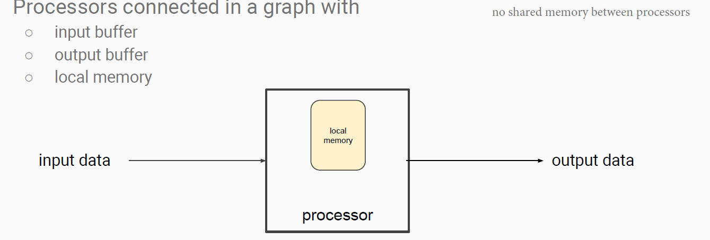

# comp90025-pmc-notes
COMP90025 - Parallel and Multicore Computing - 2020s2 - Exam review/summary sheet

<!-- TOC -->

- [comp90025-pmc-notes](#comp90025-pmc-notes)
  - [terminology](#terminology)
  - [01 introduction](#01-introduction)
    - [definition](#definition)
    - [PRAM](#pram)
    - [EREW algorithm](#erew-algorithm)
      - [optimal EREW pattern](#optimal-erew-pattern)
    - [COMMON algorithm](#common-algorithm)
    - [PRIORITY algorithm](#priority-algorithm)
      - [optimal Priority pattern](#optimal-priority-pattern)
    - [COMBINE algorithm](#combine-algorithm)
    - [CREW algorithm](#crew-algorithm)
  - [02 architecture](#02-architecture)
  - [03 OpenMP](#03-openmp)
  - [04a communication](#04a-communication)
  - [04b OpenMPI](#04b-openmpi)
  - [05 prefix sum](#05-prefix-sum)
    - [Pointer jumping](#pointer-jumping)
  - [06 sort and merge](#06-sort-and-merge)
  - [07 parallel algorithm techniques](#07-parallel-algorithm-techniques)
  - [08 cuda](#08-cuda)
  - [09 interconnection network](#09-interconnection-network)
    - [static netwrok algorithm](#static-netwrok-algorithm)
  - [10 systolic](#10-systolic)

<!-- /TOC -->

## terminology
- knowledge [location in xuliny's lecture slide]
- {xxx} link current knowledge with xxx (you can just search xxx in this document)
- def: definition

## 01 introduction
### definition
- Work: w(n) = t(n) × p(n) [problem with input size n]
  - t(n) = parallel steps
  - p(n) = #processors
- Size: 
  - total number of operations that the parallel algorithm undertakes
  - T(n) ≤ size(n) ≤ w(n) 
  - prove at [24]
- Brent's Principle: proof and def [26]
  - 
  - used to infer the best running time for a parallel algorithm that runs with a given size.
  - > [2016s2 Q1b 6marks] Brent's Principle states that if an algorithm involving a total of x operations can be performed in t time on a PRAM with sufficiently many processors, then it can be performed in time t + (x - t) / p on a PRAM with p processors.
    - > ii) Consider an algorithm that involves O(n) operations in total and O(log n) time. Using Brent's Principle or otherwise, what value of p provides optimality?
      - For Brent's principle you should find the smallest complexity of p that does not increase the run time complexity.
      - t = O(log n)
      - x = O(n)
      - then we have  t + (x - t) / p = O(log n) + O(n - log n) / p = O(log n) + O(n) / p
      - so we want O(log n) + O(n) / p = O(log n)
        - O(n) / p = O(log n)
        - p = n / log n provides optimality
- Optimality: def [27]
  - A PRAM algorithm is optimal if ...
- Efficient: def [27]
- Speedup = S(p) = T(n) / t(n) **(complexity)**
    - def [28]: reduced the complexity of the problem by a factor of S(p) by using the parallel algorithm
    - T(n) = the **best sequential complexity** for a given problem
    - t(n) = the **parallel complexity** of a given parallel algorithm
- Speedup = ts / tp **(in wall-clock time)**
  - def [36]
- Amdahl's Law: S(p) = p / (1 + (p-1)f) or  = 1/f | large p
  - f = fraction of this time that cannot be parallelized
  - predict the maximum achievable speedup for a given program
- Gustafson's Law: S(p) = p + (1 − p) s.
  - s = sequential part
- > [2013s2 Q2 10marks] Explain in equations and/or words: speedup, Amdahl's law and Gustafon's law. Then analyse the below code in terms of speedup, Amdahl's law and Gustafon's law.
  - 
  - TODO
  - Assume p = 1024
  - T(n) = 3*SIZE // SIZE iteration calculation for a, b, sum
  - t(n) = 2*SIZE // SIZE iteration calculation for a, b and sum is parallelized
  - S(p) = T(n) / t(n) = 2/3
  - By Amdahl's law, S(p) = p / (1 + (p-1)f) = 0.0005
    - f = 2*SIZE for the first loop
  - By Gustafon's law, S(p) = p + (1 − p) s = 2096128
    - s = 2*SIZE
- efficiency = E = S(p) / p = the speedup per processor
  - optimal processor allocation [29]
  - max p while maintaining optimal processor allocation? [29]
  - > [2017s2 Q1a 5 marks] In lectures we sometimes talked about "processor optimal" or "optimal processor allocation".   
    What does this mean, and  
    what is the difference between this and the definition of optimality for PRAM algorithms?
      - If E = O(1) then we say the parallel algorithm has optimal processor allocation (size equals work)
      - optimal processor allocation is achieved if speedup per processor is constant (using p processors gives a speedup of p or Theta(p)). If p can become large enough to reduce the runtime complexity to a polylogarithmic while maintaining optimal processor allocation then the algorithm would be optimal. While optimality for PRAM algorithms is achieved if runtime is polylogarithmic or doing same amount of work compared to the best sequential algorithm in a shorter steps
- feasibility: def [32]
  - 如果我们algorithm demand的资源随n增长的太快的话, 氪金也解决不了问题   
  - feasible [33]
  - feasible highly parallel [33]
  - inherently sequential [33]
  - Nick's Class: def [34]
### PRAM
- PRAM [20]
  - We only have p processors in theory, why still need it? 
    - [20] and It allows us to explore how much parallelism we can actually achieve in theory. So it helps answer the question: is it worthwhile building a computer with more processors or not, for the given problem? Also, without allowing the number of processors to be a function of problem size, we can not reduce the complexity of the best known sequential algorithm; albeit that this reduction in complexity is theoretical. Finally, it is relatively easy to efficiently use less processors than a given parallel algorithm prescribes, while it is relatively hard to devise an algorithm that efficiently uses more processes than a given (parallel) algorithm describes. So devising an algorithm that shows how to use as many processors as possible is generally more useful.
- 4 PRAM sub-categories [21]
  - C: concurrent, E: exclusive, R: read, W: write
  - EREW
  - CREW
  - CRCW
  - ERCW (not commonly used)
- 4 CW conflicts model -> CRCW is used [22]
  - ||description
    |---|---|
    |COMMON|processors都agree了才write
    |ARBITRARY|随便选一个processor去执行write
    |PRIORITY|有指定priority(processor with lowest id)的processor执行write
    |COMBINING|被write的是"a combination of what processors are going to write?"<br /> 例如: max(values written), min(), sum() <br />十分的Powerful, 比如sort in O(1) time, 但machine也不好build, 所以人们不常用
- Power of PRAM model variations
  - The models are listed in increasing order of "power":
    1. any algorithm that runs on a EREW PRAM will run on a CREW PRAM,
    2. any algorithm that runs on a CREW PRAM will run on a COMMON CRCW PRAM, and so on. 
    3. [Small PRAMs can simulate larger PRAMs](http://pages.cs.wisc.edu/~tvrdik/2/html/Section2.html#Simulation1) 
    - However it is not true in the other direction.
      - impossible example [44]
  - Any algorithm for a CRCW PRAM in the PRIORITY (COMMON/ARBITRARY/COMBINE) model 
    - can be "simulated" by 
      - an EREW PRAM with the same number of processors  
        and 
      - with the parallel time increased by only a factor of O(log p).
    - { EREW SimulatePriority }
  - Any algorithm for a PRIORITY PRAM 
    - can be simulated by
      - a COMMON PRAM with no loss in parallel time  
       and
      - provided sufficiently many processors are available.
    - { COMMON SimulatePriority }
  - CR PRAMs 
    - can be simulated by
      - EREW PRAM by
        - without using any additional processor/time complexity
    - { Optimal EREW Broadcast }
  - [forum](https://canvas.lms.unimelb.edu.au/courses/17524/discussion_topics/361358)
### EREW algorithm
- Suboptimal EREW Lambda
  - |||
    |---|---|
    |input size|n
    |t(n)|O(log n) steps
    |p(n)|p = n/2
    |T(n)|O(n)
    |Lambda|:: Ord a => (a, a) -> a
  - ```
    j = n/2

    while j ≥ 1
        for each processor i from 0 to j-1:
            input[i] = Lambda(input[2i], input[2i + 1])
        j /= 2
    
    return input[0]
    ```
- Optimal EREW Summation [42] 
    - |||
      |---|---|
      |input size|n
      |t(n)|O(n/p + log p) = O(log n) steps
      |p(n)|p = n/log n
      |T(n)|O(n)
    - optimal EREW pattern (1)
- Optimal EREW Maximum
  - |||
    |---|---|
    |input size|n^2
    |t(n)|O(n/p + log n) <br /> = O(log n / n + log n^2 - log log n) steps by substitute in p(n) <br /> = O(log n / n + 2 log n) steps <br /> = O(log n) steps
    |p(n)|p = n^2/log n
    |T(n)|O(n^2)
   - optimal EREW pattern (1)
   - ```
     # initialize
     B[p]
     for each processor i from 0 to p-1:
        B[i] = MIN
     
     for each processor i from 0 to p: # in O(log n) steps with n / log n processors
        # input size / p(n) = log n
        for j from i*(input size/p) to (i+1)*(input size/p) - 1:
            B[i] = max(B[i], input[j])
     
     # Suboptimal EREW Maximum
     #   in O(log p) steps with p/2 processors
     return Suboptimal EREW Lambda=Max (input = B, input size = p)
     ```
- Suboptimal EREW Replication [53]
  - |||
    |---|---|
    |input size|n
    |t(n)|O(log n)
    |p(n)|p = n
    |T(n)|O(n)
- Optimal EREW Replication [54]
  - |||
    |---|---|
    |input size|n
    |t(n)|O(n/p + log n)
    |p(n)|p = n/log n
    |T(n)|O(n)
  - input an arr [a1, a2, ..., an] return [a1, a1, ..., a1]
- Optimal EREW Broadcast [55]
  - |||
    |---|---|
    |input size|n
    |t(n)|O(log p) = O(log n + log log n) = O(log n) steps
    |p(n)|p = n/log n
    |T(n)|O(n)
  - processor 0 has val, have a [val, val, ..., val].size=n in memory
    - by using Suboptimal EREW Replication
- EREW SimulatePriority [59]
  - |||
    |---|---|
    |input size|n
    |t(n)|O(log n) steps
    |p(n)|p = n
    |T(n)|O(n)
  - How to execute:
    ```
    Input: W[n]: W[i] is the address that PRIORITY processor i wants to write to
    # initialize A[n] with 
    for i in range (0, p):
        A[i] = (i, w[i], False) # (index, address, whether we are allowed to write)
        
    sort(A, lambda = \x, y, z -> cmp y, then cmp x then, increase=True) # Sort by address W[i] then id[i]

    for i in range (0, p):
        if i == 0:  # Lowest id for the smallest address always wins
            (a, b, _) <- A[0]
            A[0] = (a, b, True) 
        else:
            (a, b, _) <- A[i]
            c <- A[i] 跟 A[i-1] 比较 snd; if 相等 True otherwise False
            A[i] <- (a, b, c)

    for i in range (0, p):
        if A[i].c:
            # processor i performs write
            PRIORITY processor i can write to W[i]
        else:
            Discard write operation
    ```
- Optimal EREW second largest
  > [2018s2 Q4 5marks] Consider the problem of finding the second largest number in an array of n numbers. Write an optimal EREW PRAM algorithm that does so. Show that your algorithm is optimal.
    - [link](https://cs.stackexchange.com/a/64313)
    - |||
      |---|---|
      |input size|n
      |t(n)|O(n / p + p) = O(sqrt(n) + sqrt(n)) = O(sqrt(n)) steps
      |p(n)|p = ceil(sqrt(n))
      |T(n)|O(n)
    - ```
      # input: input array
      # n: size of input array
      # p: number of processors
      Optimal EREW second_largest(input, n, p):
          if n <= 2:
              return max(input[0], input[1])

          initialize M[p], m[p]; # M for largest, m for second largest
          # O(1) step
          do in p processors for i from 0 to p-1:
              M[i] = INT_MIN
              m[i] = INT_MIN

          # sequential find second largest in subarray
          # O(n/p) steps
          do in p processors for i from 0 to p-1:
              for j from ceil(n/p)*i to ceil(n/p)*(i+1) - 1:
                  # input[j] >= M[i] >= m[i]
                  if input[j] >= M[i]:
                      m[i] = M[i]
                      M[i] = input[j]
                  # M[i] > input[j] >= m[i]
                  elif input[j] > m[i]:
                      m[i] = input[j]

          m1, m2 = INT_MIN, INT_MIN # intended m1 > m2
          # O(p) steps
          for i from 0 to p-1:
              # M[i] >= m[i] >= m1 >= m2
              if m[i] >= m1:
                  m1, m2 = M[i], m[1]
              else if M[i] >= m1:
                  # M[i] >= m1 >= m[i] >= m2
                  if m[i] > m2:
                      m2 = m[i]
                  # M[i] >= m1 >= m2 >= m[i]
                  else:
                      m2 = m1
                  m1 = M[i]
              # m1 >= M[i] >= m2 >= m[i] or m1 >= M[i] >= m[i] >= m2
              else if M[i] > m2:
                  m2 = M[i]
          
          return m2
          # work = t(n) * p(n) = O(sqrt(n)) * O(sqrt(n)) = O(n) = T(n), so it is optimal
      ```
- EREW substring occurance
  - > [2018s2 Q7 10marks] Consider the problem of counting the number of times a string of length m occurs in a string of length n > m. For example, for the string ABC of length m = 3 it occurs 3 times in the string AJ**ABC**DF**ABC**ASD**ABC**KALD of length n = 20.  
  A naive sequential solution can be done in O(mn) time steps.
    - > (b) Show how to solve the problem on an EREW PRAM with O(n) processors in a lower time complexity than the naive sequential solution, i.e. o(mn), and show what that complexity is.
  - |||
    |---|---|
    |input size|m, n, n > m
    |t(n)|O(log n) steps
    |p(n)|O(n)
    |T(n)|O(mn)
  - ```
    EREW substring_occurance(string, n, substring, m)
        # KMP: https://www.geeksforgeeks.org/kmp-algorithm-for-pattern-searching/
        # KMP has O(n) wotst case

        // create lps[] that will hold the longest prefix suffix values for pattern
        initialize lps[n], match[n]
        // Preprocess the pattern (calculate lps[] array) 
        computeLPSArray(string, n, lps)

        // O(1)
        do in processors for i from 0 to n-1:
            match[n] = 0

        int i = 0; // index for substring[] 
        int j = 0; // index for string[] 
        while (i < m) { 
            if (string[j] == substring[i]) { 
                j++; 
                i++; 
            } 
      
            if (j == n) { 
                // Found substring at index i - j
                match[i-j] = 1

                j = lps[j - 1]; 
            } 
      
            // mismatch after j matches 
            else if (i < m && string[j] != substring[i]) { 
                // Do not match lps[0..lps[j-1]] characters, 
                // they will match anyway 
                if (j != 0) 
                    j = lps[j - 1]; 
                else
                    i = i + 1; 
            } 
        }

        # O(log n)
        Optimal EREW Prefix sum on match with ceil(n / log n) processors
        
        return match[n-1]
    ```
- Optimal EREW max subsequence sum
  - > [2017s2 Q4c 10marks] Given a sequence Q of n numbers (positive and negative), the maximum subsequence of Q is the contiguous subsequence that has the maximum sum among all contiguous subsequences of Q.  
  Devise an EREW PRAM algorithm for finding the maximum subsequence of Q in O(log n) time. You may assume that Q contains 2^k elements where k ≥ 0.
    - [solution on page 4](https://citeseerx.ist.psu.edu/viewdoc/download?doi=10.1.1.88.6054&rep=rep1&type=pdf)
    - ```
      1. Compute in parallel the prex sums of Q into array PSUM	
      2. Compute in parallel the suffix sums of Q into array SSUM

      initialize ptmp[p], stmp[p], pindex[p], sindex[p]
      do in p processors for i from 0 to p-1:
          for j from (n/p)*i to (n/p)*(i+1) - 1:
          ptmp[j] = (PSUM[j], j)
          stmp[j] = (SSUM[j], j)


      (_, p_index) <- Optimal EREW Maximum ptmp with lambda \x, y -> x
      (_, s_index) <- Optimal EREW Maximum stmp with lambda \x, y -> x

      return Q[s_index: p_index+1]
      ```
- EREW primes
  - > [2016s2 Q4d 8marks] Consider the Sieve of Eratosthenes algorithm, shown below, that returns an array of length n in which the i-th position is set to true if i is a prime and to false otherwise. 
    - 
    - [algorithm 3.2](https://core.ac.uk/download/pdf/81135025.pdf)
    - 看不懂paper
#### optimal EREW pattern
- (1)
  - ```
      t(n): O(n/p + log n)
      Input: array
      initialize localArr[p]

      for each processor_i: 
          sequentially cal subarray to localArr[i]
      
      # reduce
      parallelize reducing localArr to finalResult by Suboptimal EREW algorithm (LAMBDA)
      ```
### COMMON algorithm
- Optimal COMMON Logical_OR [44]
  - |||
    |---|---|
    |input size|n
    |t(n)|O(n/p) steps
    |p(n)|n
    |T(n)|O(n^2)
  - similar to optimal EREW pattern (1)
    - except no O(log p) because we use localVar instead of localArr (no race condition beacuse we have COMMON), so no parallelize reduce just return
- Suboptimal COMMON Maximum [47]
  - |||
    |---|---|
    |input size|n^2
    |t(n)|O(log log n) steps
    |p(n)|n^2
    |T(n)|O(n)
- COMMON SimulatePriority [57]
  - |||
    |---|---|
    |input size|n
    |t(n)|O(1) steps
    |p(n)|n^2
    |T(n)|O(n) on Priority
  - How to execute:
    ```
    Input: W[n]: W[i] is the address that PRIORITY processor i wants to write to
    M[n] = [True, ..., True]
    
    check whether W has duplicate, if any, M[higher p_i] = False
      # only M[lowest i] = True if CW Conflict
    
    for i in range(0, p):
        if M[p_i]:
            # processor i performs write
            PRIORITY processor p_i can write to W[p_i]
        else:
            Discard Write operation
    ``` 
     
### PRIORITY algorithm
- Optimal PRIORITY ElementUnique
  - |||
    |---|---|
    |input size|n
    |t(n)|O(1) steps
    |p(n)|n
    |T(n)|O(n)
  - optimal Priority pattern (1)
#### optimal Priority pattern
- (1)
  - ```
      t(n): O(1)
      Input: array
      initialize localArr[p], localVar

      for each processor_i:
        localArr[input[i]] <- i  # As PRIORITY, only lowest i will be written

      for each processor_i: 
        if localArr[input[i]] != i:  # implies other processor has duplicate value
          change localArr
      
      return localArr
      ```
### COMBINE algorithm
- Optimal COMBINE substring occurance
  - > [2018s2 Q7 10marks] Consider the problem of counting the number of times a string of length m occurs in a string of length n > m. For example, for the string ABC of length m = 3 it occurs 3 times in the string AJ**ABC**DF**ABC**ASD**ABC**KALD of length n = 20.  
  A naive sequential solution can be done in O(mn) time steps.
    - > (a) Show how to solve the problem in constant time using a Combining CRCW PRAM with O(mn) processors.
  - |||
    |---|---|
    |input size|m, n, n > m
    |t(n)|O(1) steps
    |p(n)|O(mn)
    |T(n)|O(mn)
  - ```
    combine_bool_and(a, b) = write (a && b) to a
    convert(a) = if a == True then 1 else 0
    combine_int_add(a, b) = write (a + b) to a

    Optimal COMBINE CRCW substring_occurance(string, n, substring, m)
        initialize occured[n]

        # O(1) step
        do in m*n processors with ordering (i, j) where 0<=i<=n, 0<=j<=m:
            # m-1 to ensure enough characters in string[a..a+m]
            do in processors (a, 1) for a from 0 to n-(m-1)-1: 
                occured[a] = True
            do in processors (a, b) 
                for a from 0 to n-(m-1)-1: 
                    for b from 0 to m-1:
                        if string[a+b] != substring[b]:
                            combine_bool_and(occured[a], False)
        
        res = 0        
        # O(1) step
        do in processors (a, 1) for a from 0 to n-(m-1)-1:
            combine_int_add(res, convert(occured[a]))
        
        return res
    ```
- COMBINE Mamimum
  - > [2011s2 Q6 8marks] Finding the maximum of a list of numbers is a fundamental operation.
    - > [2011s2 Q6a] Show how to compute the maximum of n numbers in 0(1) time using n^2 processors on a CRCW PRAM.
      - |||
        |---|---|
        |input size|n
        |t(n)|O(1) steps
        |p(n)|p = O(n^2)
        |T(n)|O(n)
    - ```
      combine_int_max(a, b) = write max(a, b) to a

      COMBINE CRCW substring_occurance(inputs, n, p)
          initialize res = INT_MIN
    
          # O(1) step
          do in processors (a, 1) for a from 0 to n-1:
              combine_int_max(res, inputs[a])
          
          return res
      ```
      - TODO
    - > [2011s2 Q6b] Show a recursive algorithm to compute the maximum of n^2 numbers in O(log log n) time using n^2 processors on a CRCW PRAM. Your recursive algorithm may make use of your algorithm above.
      - TODO
### CREW algorithm
- CREW search
  - |||
    |---|---|
    |input size|n
    |t(n)|O(log_p n) = O(log2 n) steps
    |p(n)|p = 2
    |T(n)|O(log n)
  - > [2016s2 Q4a 8marks] Consider a sorted array of n unique integers. For a given integer x, the search problem is to determine if the array contains x. This can be done sequentially using O(log n) time (binary search). Show how search can be done in O(log_p n) time using p processors on a CREW PRAM.
    - ```
      CREW search(input, x, n)
          initialize found[p]

          subarray_size = ceil(n/p)
          // O(log2 (n/p)) = O(log2 n - log2 p)
          do in p processors for i from 0 to p-1:
              found[i] = binary search on input[subarray_size*i: subarray_size*(i+1)] with x

          res = False
          // O(p)
          for i from 0 to p-1:
              res = res && found[i]

          return res
          // t(n) = O(log2 n + p) and we want t(n) = O(log_p n)
          // so p = 2
      ```
- [PRAM algorithm techniques](https://homes.cs.washington.edu/~arvind/cs424/readings/pram.pdf)
## 02 architecture
- PE: processing element
- criticism of the PRAM [2] = why we need architecture
- Flynn's taxnomy [4]
  - SISD [5]
  - SIMD [6, 7]
    - good for data parallelism
    - GPUs contain many small SIMD modules
  - MIMD [8]
  - SIMD v.s. MIMD
    - SIMD
      - adv
        1. simple to code
        2. PRAM algorithms are close to SIMD
    - MIMD
      - adv
        1. more flexible | given a number of PE
      - disadv
        1. more expensive
        2. have multiple control unit here, which takes more space on chip and cost more time for instruction stream to arrive **(force the clock speed to be lower)**
  - MISD: There are no machines widely accepted to be MISD
- Schwartz's parallel machine classes [10]
  - paracomputers = shared memory multiprocessor
  - ultracomputer = distributed memory multiprocessor
  - Shared versus distributed memory [12]
    - shared memory system
      - = symmetric multiprocessor (SMP) | all processors are identical
      - adv: easier to code
    - distributed memory system
      - = message passing machine
      - adv: scale up with less cost
    - distributed shared memory (DSM)
      - = has distributed memory but a single address space
- > [2013s2 Q1 6marks] Illustrate the concepts parallel computing using Flynn's taxonomy and Schwartz's parallel machine architecture.
  - TODO
- Uniformity of shared memory access [13]
  - |a shared memory system can be either|||adv|disadv
    |---|---|---|---|---
    |UMA|uniform memory access|[14]|Caches improve performance| but need protocols to keep cache coherency
    |NUMA|non-uniform memory access|[15]|Access to local memory is fast| Access to remote memory is slower
    |COMA|cache-only memory architecture|[]|
- Simultaneous memory access [16]
  - Real memory access is different form theory
  - Memory Access Patterns:
    1. Memory is divided into one or more banks (roughly, sticks of RAM).
    2. Once a bank is accessed, it has a recharge time before it can be accessed again.
  - Addressing memory banks [17]   
    
  - So, parallel memory access, rather than parallel processing
- Coprocessors [18]
  - GPU and Xeon Phi
  - |adv|disadv|
    |---|---|
    |low cost parallelism|architecturally they present more challenges
- Implicit versus Explicit [19]
  - parallelism implicit/explicit
  - decomposition implicit/explicit
  - mapping implicit/explicit
  - communication implicit/explicit
  - ||adv||
    |---|---|---|
    |implicit|easier to code
    |explicit|high performance|OpenMP
- SPMD and MPMD [20]
  |||def|Framework
  |---|---|---|---|
  |SPMD|Single Program Multiple Data|a single program that executes on a different portion of the data|OpenMP #pragma for<br />OpenMPI<br />OpenCL
  |MPMD|Multiple Program Multiple Data|1. different programs are written, for different threads<br /> 2. one thread may be a "master" thread, with different code from "worker" threads|OpenMP #pragma sections/single
- |parallelism model||suitable when||
  |---|---|---|---|
  |Thread parallelism model|[21]|running on<br /> 1. a single UMA machine or <br />2. a distributed shared memory architecture that implicitly distributes threads|OpenMP
  |Process parallelism model|[22]|running on multiple machines, i.e., when there is no shared memory (NUMA).
  |Hybrid parallelism model|[23]|running a single process on each machine and having each process use multiple threads

## 03 OpenMP
- What is OpenMP? [3]
  - Thread Parallelism model
  - Explicit Parallelism
  - Fork-Join Model [4]
- Compiler Directives [7]
  - ``` #pragma omp parallel default ( shared ) private ( beta ) ```
- Run-time Library Routines [8, 9]
  - ``` int omp_get_num_threads ( void ); ```
  - [大全](https://software.intel.com/content/www/us/en/develop/documentation/cpp-compiler-developer-guide-and-reference/top/optimization-and-programming-guide/openmp-support/openmp-library-support/openmp-run-time-library-routines.html)
- Environment Variables [16, 17]
  - ``` export OMP_NUM_THREADS=10 ```
  - ```OMP_DYNAMIC```
  - ```OMP_NESTED```
  - ```OMP_THREAD_LIMIT```
  - ```OMP_STACKSIZE```
  - [大全](https://docs.oracle.com/cd/E19205-01/819-5270/aewcb/index.html)
- C/C++ general code structure [10, 11, 12]
- OpenMP Directives [18, 19, 20, 21, 22, 23, 24]
  - ``` 
    # pragma omp parallel [ clause [ clause ...]] 
    structured_block 
    ```
  - Work-Sharing Constructs 
    - NOWAIT
      - If specified, then threads do not synchronize at the end of the parallel loop.
    - ``` #pramga omp parallel for ``` [23]
      - SCHEDULE (Dynamic vs Static [24, 28]) 
        - Describes how iterations of the loop are divided among the threads in the team.
        - |scheduler|adv|disadv
          |---|---|---|
          |Dynamic|better when the iterations may take very different amounts of time|has scheduler overhead <br />After each iteration, the threads must stop and receive a new value of the loop variable to use for its next iteration.
          |Guided|allows a tradeoff: <br /> 1. less overhead than dynamic <br />2. better splitting of workload among threads than static.
      - ORDERED clause [30]
        - Specifies that the iterations of the loop must be executed as they would be in a serial program.
      - COLLAPSE clause [31]
        - Specifies how many loops in a nested loop should be collapsed into one large iteration space and divided according to the schedule clause.
    - ``` 
      #pramga omp sections [ nowait ] 
          # pragma omp section
              structured_block
          # pragma omp section
              structured_block
          # pragma omp section
              structured_block
      ``` 
      [32, 33]
    - ```
      # pragma omp single [ nowait ]
          structured_block
      ```
      [34, 35]
- Synchronization and sharing variables
  1. critical [37]: ensures executions of the critical block to one thread at a time.
  2. barrier [38]: ensures that all threads in the team have reach the barrier before any
thread is allowed to continue beyond the barrier
  3. atomic [39]: ensures that updates to a variable are free from conflict.
     - atomic v.s. critical [39]
  4. Example - parallel pi program
- Memory Consistency and flush
  1. flush [40, 41, 42, 43]
- Data environment
  1. stack and heap [44]
     - In a multi-threaded situation each thread will have its own completely independent stack,
       - so the threads will copy the stack variables but they will share the heap variables.
  2. shared and private [45, 46, 47]
  3. firstprivate(x) [48]
     - initializes each private copy with the corresponding value from the master thread
  4. lastprivate(x) [49]
     - passes the value of a private from the last thread to a global variable.
  5. reduction [50, 51]
     - ``` # pragma omp parallel for reduction(+:x) default (shared) ```
       - add will initialize x with default 0
       - perform add in each thread
       - and add all threads' results and global variable to global variable
- Dijkstra algorithm [52, 53, 54, 55]
## 04a communication
- Time to send a message: t_m
  - t_m = t_f + t_b * l
    - t_f = a fixed time
    - t_b = a time per byte
    - l = number of bytes in the message
  - efficient message passing = t_b * l >> t_f
  - > [2017s2 Q4a 10marks] Consider two processors, A and B, each having a sorted list of k integers.  
  Consider the problem of finding the k smallest integers from the combined 2k integers, i.e. where the answer should be available on processor A.  
  One trivial way to do this is for processor B to send its entire list to processor A, and then A merges them to obtain the smallest k.  
  Assuming computation time is negligible, this would take time t_m = t_s + k t_d, where ts
is startup time and td is the time to send an integer.  
  Assuming computation time is negligible, is there a faster way (on average) to obtain the result at A? Provide your reasoning and any further assumptions made.
    - ```
      Assume k = 2^t, t > 0
      Assume we have sorted list_B on processor B
      On processor B:
          t = log2 k
          for i from 0 to k / t:
              start, end = i * t, (i+1) * t
              send list_B[start: end] to processor A
              if receive a 0 from processor A:
                  break
      // on average, we just send k/t/2 round which is k/t/2 * t = k / 2 elements to processor A
      // on average, we just receive t/2 integers from processor A
      // So we have k / 2 + log2 k integers being transferred rather than k in the naive approach on average
      // So we have k + log2 k integers being transferred rather than k in the naive approach in worst case, whole B_list are k smallest
      // So we have log2 k + 1 integers being transferred rather than k in the naive approach in best case, whole A_list are k smallest
      ```
- Parallel run time: t_p
  - t_p = t_comp + t_comm
    - t_comp: computation time
    - t_comm: communication time
  - speedup: S
    - S = t_s / t_p
      - t_s: sequential time
- Delay hiding [6]
  - = when t_p not valid?
  - Communication and computation can happen at the same time
  - Part of the art of parallel programming is making sure that all processors/processes have enough data to keep them busy
- Granularity [7]
  - granularity = t_comp / t_comm
  - tradeoff between parallelism and communication
- Communication primitives [8]
  - what are the basic tasks happen when send data
- send() and receive() [9, 10]
  - send/receive(destination identifier, message type, data type and contents)
  - blocking or or local-blocking non-blocking [11, 12, 13, 14]
    - non-blocking(): send will keep sending in the background
    - non-blocking(): receive will typically return whatever data has been received so far, and indicate to the caller how much has been read [15]
  - Blocking and non-blocking connote (意味着) synchronous and asynchronous communication. [16]
- Communication patterns [17-26]
  - Why we need communication pattern?
    - Distributed memory architectures require message passing and this in turn leads to communication patterns.
    - Shared memory parallel programs don't explicitly use communication patterns
    - Distributed shared memory architecture needs
## 04b OpenMPI

## 05 prefix sum
- sequential prefix sum (or other dyadic operation)
  - |||
    |---|---|
    |input size|n
    |T(n)|O(n)
  - ```
    int X[n];
    for(i=1; i<n; i++) {
        X[i] = X[i-1] + X[i];
    }
    ```
- Suboptimal CREW Upper/Lower parallel prefix algorithm [6]
  - |||
    |---|---|
    |input size|n
    |t(n)|O(log n)
    |p(n)|p = n
    |T(n)|O(n)
  - can use { Optimal EREW Broadcast } to make CREW to EREW for operation on line 12
  - Execution on X = [5, 2, 3, 8, 2, 3, 4, 5], n = 8
    - -> means the return of the function call
    - line 7, UpperLower([5, 2, 3, 8], 4) -> S[0:4] = [5, 7, 10, 18]
      - line 7, UpperLower([5, 2], 2) -> S[0:2] = [5, 7]
        - line 7, UpperLower([5], 1) -> S[0:1] = 5
        - line 9, UpperLower([2], 1) -> S[1:2] = 2
        - // now S = [5, 7]
        - line 10, i from 1 to 1:
          - S[1] += S[0] -> S[1] = 5+2 = 7
        - return S = [5, 7]
      - line 9, UpperLower([3, 8], 2) -> S[2:4] = [3, 11]
        - line 7, UpperLower([3], 1) -> S[0:1] = 3
        - line 9, UpperLower([8], 1) -> S[1:2] = 8
        - // now S = [3, 8]
        - line 10, i from 1 to 1:
          - S[1] += S[0] -> S[1] = 3+8 = 11
        - return S = [3, 11]
      - // now S = [5, 7, 3, 11]
      - line 10, i from 2 to 3:
        - S[2] += S[1] -> S[2] = 7+3 = 10
        - S[3] += S[1] -> S[3] = 11+7 = 18
      - return S = [5, 7, 10, 18]
    - line 9, UpperLower([2, 3, 4, 5], 4) -> S[4:8] = [2, 5, 9, 14]
      - line 7, UpperLower([2, 3], 2) -> S[0:2] = [2, 5]
        - line 7, UpperLower([2], 1) -> S[0:1] = 2
        - line 9, UpperLower([3], 1) -> S[1:2] = 3
        - // now S = [2, 3]
        - line 10, i from 1 to 1:
          - S[1] += S[0] -> S[1] = 2+3 = 5
        - return S = [2, 5]
      - line 9, UpperLower([4, 5], 2) -> S[2:4] = [4, 9]
        - line 7, UpperLower([4], 1) -> S[0:1] = 4
        - line 9, UpperLower([5], 1) -> S[1:2] = 5
        - // now S = [4, 5]
        - line 10, i from 1 to 1:
          - S[1] += S[0] -> S[1] = 4+5 = 9
        - return S = [4, 9]
      - // now S = [2, 5, 4, 9]
      - line 10, i from 2 to 3:
        - S[2] += S[1] -> S[2] = 5+4 = 9
        - S[3] += S[1] -> S[3] = 5+9 = 14
      - return S = [2, 5, 9, 14]
    - // now S = [5, 7, 10, 18, 2, 5, 4, 9]
      - line 10, i from 4 to 7:
        - S[4] += S[3] -> S[4] = 2+18 = 20
        - S[5] += S[3] -> S[5] = 5+18 = 23
        - S[6] += S[3] -> S[6] = 9+18 = 27
        - S[7] += S[3] -> S[7] = 14+18 = 32
    - return S = [5, 7, 10, 18, 20, 23, 27, 32]
- Suboptimal EREW Odd/Even parallel prefix algorithm [12, 13]
  - |||
    |---|---|
    |input size|n
    |t(n)|O(log n)
    |p(n)|p = n
    |T(n)|O(n)
  - [forum](https://canvas.lms.unimelb.edu.au/courses/17524/discussion_topics/361608)
  - Execution on X = [5, 2, 3, 8, 2, 3, 4, 5], n = 8
    - -> means the return of the function call
    - line 2, False
    - line 8, index [0, 2, 4, 6] gives
      - S = [5, _, 3, _, 2, _, 4, _]
    - line 11, index [1, 3, 5, 7] gives
      - P's index floor(i/2) = [0, 1, 2, 3]
      - P = [7, 11, 5, 9]
    - line 13, OddEven(X=P, 4) -> A = [7, 18, 23, 32]
      - line 2, True
        - S = [7, ...]
        - for i from 1 to 3
          - S[1] = X[1] + S[0] = 11+7 = 18
          - S[2] = X[2] + S[1] = 5+18 = 23
          - S[3] = X[3] + S[2] = 9+23 = 32
        - return S = [7, 18, 23, 32]
    - line 14, for index from 2 to 7
      - line 15, for index [2, 4, 6]
        - S[2] += A[0] = 3+7 = 10
        - S[4] += A[1] = 2+18 = 20
        - S[6] += A[2] = 4+23 = 27
    - // now S = [5, _, 10, _, 20, _, 27, _]
    - line 17, for index [1, 3, 5, 7]
      - S = [5, 7, 10, 18, 20, 23, 27, 32]
    - return S = [5, 7, 10, 18, 20, 23, 27, 32]
- Ladner and Fischer's parallel prefix algorithm [18]
- Optimal EREW Prefix sum
  - |||
    |---|---|
    |input size|n
    |t(n)|O(log n)
    |p(n)|p = n / log n
    |T(n)|O(n)
  - ```
    input[n]
    # do sequential prefix sum on sub-array size=log(n) in parallel
    # O(n/p) = O(log n) steps
    for processor_i in range(0, p) do in parallel:
        for j in range(ceil( i * (n/p) ) + 1, ceil( (i+1) * (n/p) ) :  # +1 as first element in subarray doesn't need to be prefixed
            input[j] += input[j-1]

    # O(p) steps
    for k in range(1, p):
        last <- input[ceil(k * (n/p)) - 1]  # take sub-array (k-1)'s last prefix sum

        # O(1) step
        for processor_i in range(0, p) do in parallel:
            input[ceil(k*p) + i] += last  # update previous subarray's prefix to cur subarray
    ```
### Pointer jumping
- P is a list of nodes and P[i] ∈ P is a pointer to a node in P
- Suboptimal EREW ListRank [27]
  - |||
    |---|---|
    |input size|n
    |t(n)|O(log n) steps
    |p(n)|n
    |T(n)|O(n)
  - Execution on [tute07 6-16]
- Optimal EREW ListRank [27]
  - Change line 4 in slide 30 for { Optimal EREW ListPrefixSum } to: 
    - ``` S[i] <- If P[i].next == NULL then 0 else 1. ```
- Sumoptimal CREW FindRoots [28]
  - |||
    |---|---|
    |input size|n
    |t(n)|O(log n) steps
    |p(n)|n
    |T(n)|O(n)
- Suboptimal EREW ListPrefixSum [29]
  - |||
    |---|---|
    |input size|n
    |t(n)|O(log n) steps
    |p(n)|n
    |T(n)|O(n)
  - Execution on [tute07 18-23]
- Optimal EREW ListPrefixSum [30, 31]
  - |||
    |---|---|
    |input size|n
    |t(n)|O(n/p + log p) steps
    |p(n)|p = n / log n
    |T(n)|O(n)
  - similar idea as { Optimal EREW Prefix sum }
    - divide whole list to sublist with size = log n, sequential sum each sublist on each processor
    - parallelize previous sublist result to cur sublist
  - Or use { Optimal EREW ListRank } and { Optimal EREW PrefixSum } [31]
    - convert list to array by ListRank
    - prefix sum the converted array
- [parallel tree traversal](https://cse.iitkgp.ac.in/~debdeep/courses_iitkgp/PAlgo/Autumn16-17/slides/Lect4PJumping.pdf)

## 06 sort and merge
- Optimal EREW Compation [3, 4]
  - |||
    |---|---|
    |input size|n
    |t(n)|O(n/p + log p) steps
    |p(n)|p = n / log n
    |T(n)|O(n)
  - input array X has k non-empty elements and 把non-empty elements移动到前k个position
    - [null, 1, null, null, 4] -> [1, 4, null, null, null]
- Optimal EREW UniqueCounts [5, 6, 7]
  - |||
    |---|---|
    |input size|n, n>0
    |t(n)|O(n/p + log p) steps
    |p(n)|p = n / log n
    |T(n)|O(n)
  - input sorted array X and return [(value, value's counts in X), ...]; result padded with null to have size = X.size
    - [1,1,1,2,3,3,5,6,6,6,6] -> [(1, 3), (2, 1), (3, 2), (5, 1), (6, 4), null, null, null, null, null, null]
- Optimal EREW Distribute [8, 9, 10]
  - |||
    |---|---|
    |input size|n
    |t(n)|O(n/p + log p) steps
    |p(n)|p = ceil(n / log n), ceil because <br /> n = 8, <br />p = n / log n = 3 (round up)<br />if not round up, will miss elements<br /> n / p = 3
    |T(n)|O(n)
  - input array X, with some null and return nonempty elements copied to itself and all consecutive nonempty positions
    - **Require X[0] != null**
    - [6, 3, null, null, 5, null, null] -> [6, 3, 3, 3, 5, 5, 5]
- Optimal EREW Merge [16-19]
  - |||
    |---|---|
    |input size|n, n=sum(n1, n2)
    |t(n)|O(n/p + log p) steps
    |p(n)|p = n / log n
    |T(n)|O(n)
  - merge two sorted array A, B
- Suboptimal EREW MergeSort [20]
    - |||
      |---|---|
      |input size|n
      |t(n)|O(n/p * log(n/p) +  (n/p + log p) * log p) steps <br />p = n, O((log n)^2), work = O(n (log n)^2)
      |p(n)|p = n
      |T(n)|O(n log n)
- Suboptimal CREW RankMerge [24]
  - |||
    |---|---|
    |input size|n
    |t(n)|O(log n) steps, sequential binary search
    |p(n)|p = n
    |T(n)|O(n)
  - merge two array with n unique elements in each array
  - on EREW, t(n) = O(n), p(n) = 0(n) [22]
  - on EREW, t(n) = O(log n), p(n) = 0(n^2) [23]
  - on CRCW, t(n) = O(1), p(n) = 0(n^2) [23]
  - (above algorithm)[https://www.massey.ac.nz/~mjjohnso/notes/59735/myslides8.pdf]
- Bitonic Mergesort [25-29]
  - |||
    |---|---|
    |input size|n
    |t(n)|O(log log n) steps
    |p(n)|p = n
    |T(n)|O(n log n)
  - [pseudo code](https://en.wikipedia.org/wiki/Bitonic_sorter) and [c code](https://www2.cs.duke.edu/courses/fall08/cps196.1/Pthreads/bitonic.c)
- Optimal parallel merging & sorting
  - do not require reading from or writing into the same memory location simultaneously, 
    - hence they can be applied on a EREW machine
  - merge [31]
    - |||
      |---|---|
      |input size|n
      |t(n)|O(n / p) = O(sqrt(n)) steps
      |p(n)|p = sqrt(n)
      |T(n)|O(n log n)
    - lemma proving in [tute09 10-16]
  - Multiway Parallel Sort [34]
    - |||
      |---|---|
      |input size|n
      |t(n)|O(n log n / p) = O(sqrt(n) * log n) steps
      |p(n)|p = sqrt(n)
      |T(n)|O(n log n)
  - [more](tute 09-1)
- QuickSort [14 and below link]
- [lots of parallel sort](http://web.cse.msstate.edu/~luke/Courses/sp19/CSE4163/Slides/DPA_Sorting.pdf)


## 07 parallel algorithm techniques
- Algorithms can be loosely classified as 1+ of:
  - |||e.g.|
    |---|---|---|
    |embarrassingly parallel|first three are pretty overlap. break massive data (can't be solved on one supercomputer) to several independent pieces and processed. Thus get parallelism so easily|grid computing
    |parametric|first three are pretty overlap. A parametric problem is a data parallel problem. Divide problem based on a parameter space (parameter space can be very large). You have a parameter define the problem space and values for a given set of parameters define one instance of the computation can be done independently.
    |data parallel|first three are pretty overlap. easy to break down to disjoint piece that can be distributed to different process and done independently. Results are put together afterwards
    |task parallel|have different computing done for different task. like a pipline (different stage of computation, you get parallelism because you run various instance of the problem concurrently)|dynamic loading
    |loosely synchronous|synchronize within a group of nodes in the system or a subset tasks of total tasks.|Red-Black ordering
    |synchronous|refer to problem reuqire a lot of communication. typically, require communication at the end of each step. you might need a barrier. granularity needs to be large which might makes you not get speedup|N-body
- Geometric transformations of images [3]
- Shifting [4]
- Scaling [5]
- Rotation [6]
- Clipping [7]
- Image smoothing [8]
- Partitioning [9-11]
  - square partition and column partition
    - If communication between processes does not take place then either method is acceptable.
    - otherwise  
      
    - > [2017s2 Q2b 4marks] When dividing a problem space over a number of processors, e.g. an image, sometimes the space can be divided into square regions and sometimes it can be divided into columns (or strips).  
      Assume that the time taken to send a message of k elements from one processor to another is t_m = t_s + k * t_d, where ts is startup time and td is the time taken per element.  
      What is the condition on t_s for the square partitioning method to take less time than the column partitioning method? Show your working out and any further assumptions that you require.
      - Assume we have n images where n = 2^t, t > 1
      - Assume we have n processors available for square partition. then it has sqrt(n) processors per row
      - Assume we have n processors available for column partition. then has n processors for n columns.
      - t_sq = 8(t_s + sqrt(n)*t_d)
        - k = sqrt(n) here to send and receive between processors
      - t_col = 4(ts + n*t_d)
        - k = n here to send and receive between processors
      - t_sq < t_col
        - 8(t_s + sqrt(n)\*t_d) < 4(ts + n\*t_d)
        - 4t_s < (4n - 8sqrt(n)) t_d
        - t_s < (n - 2sqrt(n)) t_d
- Mandelbrot Set [12-14]
- Dynamic Load Balancing [15]
- Monte Carlo Methods [16-19]
- N-Body Problem [20-29]
  - Barnes-Hut Algorithm [30-33]
  - Orthogonal recursive bisection [34]
    - > [2011s2 Q9 4marks] Explain the technique of orthogonal recursive bisection, give a reason for its use and a reason against.
      - for: The octtree or quadtree does not lead to a balanced computation since some children will contain no particles. An orthogonal recursive bisection attempts to provide a more balanced division of space. Thus O(n^2) is reduced to O(n logn) in worst case
      - against: The against would be that it requires computations to construct an ORB whereas the quadtree does not.
- Jacobi iteration [36]
- Laplace's equation [37-44]
  - Gauss-Seidel relaxation [45]
  - Red-Black ordering [46-47]
  - Multi-grid technique [48]
- Termination
  - Centralised Program Termination [50]
  - Decentralised Program Termination [51]
    - Acknowledgement Messages [52-54]
    - Ring Termination Algorithm [55]
      - single pass [56, 58]
      - dual pass [57-58]
    - Tree Termination Algorithm [59]
    - Fixed Energy Distribution Termination [60]
- Navier-Stokes equation [61-63]
- [2019s2 Q6b 2marks] Consider a problem that breaks down into a large number of independent computational jobs, where the time for each job may vary considerably. Briefly describe two approaches, one for OpenMP and one for MPI, that can be used to efficiently complete all of the jobs.
  - OpenMP: schedule(dynamic)
  - MPI: master-slave with dynamic loading
## 08 cuda
- > [2011s2 Q8 2marks] 
  - The execution time is not consistent in a 32 threads wrap. Thus, we have divergence within a warp. This is what a GPU cannot do efficiently.

## 09 interconnection network
- why we need it?
  - Both the shared memory and distributed memory architectures **require an interconnection network to** connect the processor and memory or the modules respectively.
- Types:
  - buses
    - b: #buses
    - m: #memories
    - p: #processors
    - |Multi-bus systems||connections||
      |---|---|---|---|
      |full b-bus memory connection system|[3]|b(p+m)
      |partial b-bus memory connection system|[4]|b(p+m/g), 1<g<b
      |single b-bus memory connection system|[5]|bp+m|each processor has connection to a memory, but one can write at each time
    - bandwidth O(1/p)
      - all p nodes on a bus are continuously requesting access then a bus can supply O(1/p) of its available bandwidth to each node.
    - minimum latency O(1) for each bus
      - with no contention, is constant or O(1) (which ignores signal propagation delay)
    - > [2019s2 Q5b 2marks] Name and explain an advantage and a disadvantage of using a bus for a shared-memory computer, compared with other architectures.
      - TODO check correctness
      - adv: easy to add new processor/memory to the system
      - disadv: has a communication bottleneck, all p nodes on a bus are continuously requesting access then a bus can supply O(1/p) of its available bandwidth to each node.
  - static networks (point-to-point networks)
    - = fixed point-to-point connections between modules
    - Message passing is required between the modules 
        - for any module to access the memory of any other module (for a shared addresss space machine) or
        - for processors to communicate (in a message passing machine).
      - Communication module [8]  
        
    - > [2018s2 Q1d 4marks]  Define the diameter and degree of a static interconnection network.  
        Explain why these two properties are important from a parallel computer architecture perspective and explain the tradeoff between them.
        - We want a small diameter because communication complexity is determined by the diameter of the architecture: either impacting the total time for sending a message or lower bounding the best runtime of an algorithm for that architecture. We want a small degree because it reduces the wiring complexity of the architecture, which makes it easier to physically build. They are important because of the cost = degree * diameter. It is desirable to achieve a low cost. Consequently, small degree and diameter at the same time is desirable. The tradeoff is a decreasing degree might an increasing diameter which is the tradeoff. As a result, we need to find a balance between them to achieve a low cost.
    - > [2017s2 Q1b 4marks] How does our notion of algorithm optimality change when, rather than shared memory, we consider algorithms that run on an architecture such as a mesh or hypercube?
      - Rather than considering work = sequential time complexity or parallel algorithm has polylogarithmic runtime, the optimal complexity of an algorithm run on a static network is lower bounded (usually) by the diameter of the architecture; e.g. for a mesh of n nodes, sorting can't be any better than \sqrt(n) runtime.
    - |Topological property|def|when useful
      |---|---|---|
      |degree/cost to build|d = maximum number of edges connected to a single vertex in the graph
      |diameter/communication delay|k = the minimum number of edges a message must traverse in order to be communicated between any two vertices in the graph
      |cost|c = d*k|a compromise between d and k<br />it is desirable to achieve a low cost for static network
      |||
      |(edge) bisection width|smallest number of edges that, when cut, would separate the network into two halves|useful for reliability
      |planarity|Can the network be embedded in a plane without any edges crossing|useful for integrated circuits as it eliminates the need for multiple layers = 简化physical建造的难度
      |symmetry|Are all nodes topologically the same|easier to construct in hardware
    - n vertices  
      |network||d|k|c = d*k|bisection|planarity|symmetric|disadv
      |---|---|---|---|---|---|---|---|---|
      |linear array|[12]|2|O(n)|O(n)|1|y
      |||||||||
      |ring|[13]|2|floor(n/2)<br/>= half of the ring|O(n)|2|y
      |chordal ring|[14]|3|n/3|O(n)
      |completely connected|[16]|n-1|1|O(n)
      |Barrel shifter, t = log2 n|[17]|2t-1|t/2|O(t^2)<br />= O((log2 n)^2)|good|
      |||||||||
      |mesh, n = i*j|[18]|4|2sqrt(n)|O(sqrt(n)) if i==j|sqrt(n)|y
      |torus|[19]|4|sqrt(n)+1|O(sqrt(n))|||y
      |||||||||
      |hypercube, t = log2 n|[20]|t|t|O(t^2)<br />= O((log2 n)^2)|n/2
      |Cube Connected Cycles<br/>n = t 2^t<br/>t = O(log n/ log log n)|[21]|3|2t + floor(t/2) - 2, t>3|**O(t) = O(log n/ log log n)**|
      |||||||||
      |tree, t = log n|[23]|t|log_t n|O(t log_t n) = O((log n)^2 / log log n)||y||traffic on top nodes are busy
      |fat tree|[24]
      |K-ary fat tree|[25]
    - > [2019s2 Q5a 3marks] A mesh network has a relatively high cost as measured by degree times diameter, compared to other networks like the hypercube and tree. However, it is a justifiable choice for an interconnection network. Give 3 reasons why.
      - mesh has a constant time degree which makes it has a lower wiring complexity of the architecture
      - mesh has planarity which makes it useful for integrated circuits as it eliminates the need for multiple layers
      - TODO no idea
    - > [2019s2 Q5c 5marks] Prove that any algorithm running in time T in a two-dimensional
mesh of size n\*n processors can be executed in a one-dimensional mesh (i.e. a linear array) of n^2 processors in O(n T) time.
      - TODO no idea
  - switching networks
    - switch  
      
    - With switching networks, the hardware cost is no longer proportional to the degree d. 
      - Instead, we measure the **complexity = the number of switching elements**
    - the optimal complexity's definition changes for algorithm run the switch network?
      - Yes, since the communication is bounded by the switching network, and it is a function of the minimum latency of the switching network.
    - n = number of inputs and outputs
      |switch network||stage|complexity|minimum latency|other
      |---|---|---|---|---|---|
      |crossbar|[27]||O(n^2)|O(1)<br/>any 1-to-1 mapping of inputs to outputs is possible|= n-bus with single bus memory connections|
      |Clos|[28-30]||< O(n^2)
      |Benes|[31]|2*log2 n - 1<br/>= O(log n)|n log2 n - n/2 <br/>= O(n log n)|O(1)|= Clos with m=n=2
      |Omega|[32]|log2 n<br/>= O(log n)|n/2 * log2 n <br/>=  O(n log n)|O(n log n)|some 1-to-1 I/O mappings require up to log n phases to be realized
      - Why multistage?
        - This reduces the switching complexity of the center stage.
      - [sort netwrok](https://www.inf.hs-flensburg.de/lang/algorithmen/sortieren/networks/sortieren.htm)
        - 
### static netwrok algorithm
- Ring Broadcast
  - [L2019 "Hypercube and Embeddings" 2]
- Mesh broadcast
  - [L2019 "Hypercube and Embeddings" 3-5]
- Hybercube broadcast
  - [L2019 "Hypercube and Embeddings" 3, 7]
- Hypercube Sum and result stored in node 0 at the end
  - [L2019 "Hypercube and Embeddings" 8-9]
  - |||
    |---|---|
    |input size|n = 2^t
    |t(n)|O(t) = O(log n) rounds
- Hypercube Prefix Sum
  - [L2019 "Hypercube and Embeddings" 10-12]
  - |||
    |---|---|
    |input size|n = 2^t
    |t(n)|O(t^2) = O(log^2 n) rounds
- Optimal Hypercube Prefix Sum
  - [pseudo code 1](https://www8.cs.umu.se/kurser/5DV050/VT11/lab1.pdf)
  - pseudo code 2  
    
  - |||
    |---|---|
    |input size|n = 2^t
    |t(n)|O(t) = O(log n) rounds
- Hypercube bitonic mergesort
  - [L2019 "Hypercube and Embeddings" 17-18]
  - |||
    |---|---|
    |input size|n = 2^t
    |t(n)|O(t^2) = O(log^2 n) rounds
- Hypercude bufferfly barrier
  - > [2018s2 Q3a 5marks] The following diagram shows a butterfly construction (on eight processors) that can be used for barrier synchronization. Each arrow represents a synchronization message.  
Write a parallel algorithm that implements the butterfly barrier on a hypercube of n = 2^t processors.
    - 
  - |||
    |---|---|
    |input size|n = 2^t
  - ```
    # p: number of processors, p=2^t
    Hypercude bufferfly barrier(p)

    for k from 1 to t+1:
        do in p processors for i from 0 to p-1:
            # map, send in cur round
            if k < t+1:
                group_size = 2^k
                cur_group = floor(i / group_size) + 1
                group_upper = cur_group*group_size - 1

                if i+k > group_upper:
                    send msg to processor group_upper - k
                else:
                    send msg to processor (i+k)
            
            # remap, receive from sender in previous round
            if k > 1:
                group_size = 2^(k-1)
                cur_group = floor(i / group_size)
                group_lower = cur_group*group_size
                group_upper = cur_group*group_size - 1

                if i-(k-1) < group_lower:
                    receive msg to processor group_lower + (k-1)
                else:
                    receive msg to processor i-(k-1)

    ```
- Hypercube Martix multiplication
  - > [2019s2 Q7 10marks] Given the matrices A = a_{j,k} and B = b_{j,k} for 0 <= j, k <= 1 and n = 2^q and q >= 1 write a parallel algorithm to compute a matrix C = c_{j,k} for 0 <= j, k <= 1 containing the product of matrices A and B, i.e. C = AB.  
  Assume that the algorithm will be implemented in a cube of p = n^3 = 2^{3q} processors and that the elements of the input matrics A, B and output matrix C are stored in the respective processor of the cube (in the first 2 dimensional plane).
    - [Matrix Multiplication using Hypercube Network](https://www.tutorialspoint.com/parallel_algorithm/matrix_multiplication.htm)
- Mesh bitonic sort
  - [link](http://www.seerc.org/wmc8/procedings_web/pages205-226.pdf)
- Mesh UniqueElements
  - [2016s2 Q4b 8marks] Consider a mesh of size sqrt(n) \* sqrt(n) nodes, where each node of the mesh contains an integer. The uniqueness problem is to determine whether all of the integers are unique. Consider a parallel algorithm that results in every node of the mesh knowing the result of the uniqueness problem. Show how this can be done in O(n log n) steps.
    - TODO no idea
- > [2017s2 Q4b 10marks] Consider an n × n mesh network, where each processor, (i, j), i, j ∈ {1, 2, . . . , n}, contains an element a_{i,j} of a matrix A.   
Assuming each edge of the mesh can send one element per time step (in both directions),  
describe the communication steps required to transpose the matrix over the mesh, i.e. so that processor (i, j) obtains a_{j,i}. How many steps in total does this take?
  - TODO no idea. sqrt(n) steps?
## 10 systolic
- Different from PRAM model
  - no shared memory between processors
  - 
- Different from cuda
- Systolic algorithms consider the flow of data through an array of processing elements. 
- The processing elements themselves do not have access to any global memory, 
  - but rather just to values from adjacent processing elements.
- Processing elements 
  - read from their input buffers and local memory, 
  - undertake some computation and 
  - write results to their output buffers.
  - Output buffers are copied across to the input buffers of adjacent processing elements.
  - 
- Granularity: good
  - little work for each synchronization and communication step
- Sort on a systolic linear array
  - 
  - ```
    update_cell(input, ouput)
        if local == NULL:
            local = input
        else if input >= cell:
            output = input
        else # input < local:
            output = local
            local = input
    ```
  - speedup = O(log n)
    - T(n) = O(n log n)
    - t(n) = O(n)
- Matrix-vector multiplication
  - 
  - ```
    update_cell(input_x, input_A, ouput)
        if local == NULL:
            local = 0
        local += input_x * input_A 
        output = input_x
    ```
    - speedup = O(n)
    - T(n) = O(n^2)
    - t(n) = O(n)
- Matrix-matrix multiplication
  - 
  - ```
    update_cell(input_A, input_B, ouput_x, output_y)
        if local == NULL:
            local = 0
        local += input_A * input_B
        output_x = input_B
        output_y = input_A
    ```
    - speedup = O(n^2)
    - T(n) = O(n^3)
    - t(n) = 2n - 1 = O(n)
      - n parallel steps, n: number of cells
        - n for first element to arrive last processor
        - n-1 for last arrive first element's position in matrix's row/columns
        - n-1 for padding (possible)
- Prefix sum on a systolic linear array
  - 
  - ```
    update_cell(input, ouput)
        if local == NULL:
            local = 0
        local += input
        output = input
    ```
    need to reverse the array at the end
  - aviod reverse
    - ```
      local = (stored value, #elements seen)
            = (Null, 0)
  
      update_cell(input, ouput)
          seen = (snd local) + 1
          
          # seen == 1
          if (fst local) == NULL:
              local = (input, seen)
              output = NULL
              return
          
          local = (fst local, seen)
          
          if seen == 2:
              output = input + (fst local)
          else if seen > 2:
              output = input
      ```
   - speedup = O(1)
      - T(n) = O(n)
      - t(n) = O(n)
